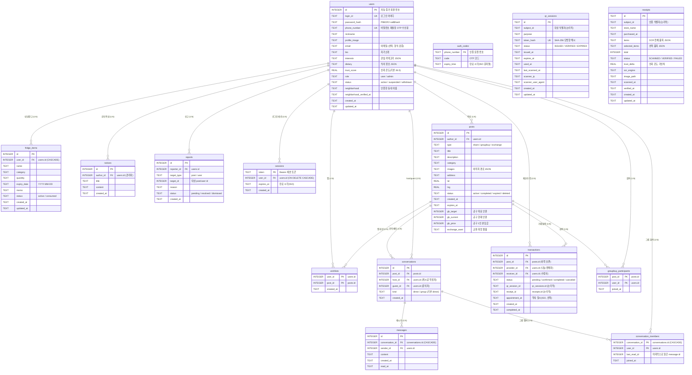

# NeighborFood ERD 문서

동네 식재료 나눔·공동구매·교환 플랫폼의 데이터베이스 구조 및 프로젝트 디렉토리 문서입니다.
3개로 분리돼 있던 SQLite(`auth.db` / `qr_auth.db` / `receipt_auth.db`)를 **단일 SQLite 파일(`data/neighborfood.db`)** 로 통합하고, 회원 기능 도입에 맞춰 `users`·`sessions`·`transactions`·`groupbuy_participants`를 추가한 현행 구조를 정리합니다.

> 최종 갱신: 2026-07-08
> · 내 냉장고(`fridge_items`) · 그룹 채팅(`conversations.kind`·`conversation_members`) · 관리자 기능(`notices`·`reports`) 추가 (2026-06-13)
> · `users` 프로필 확장(`email`·`bio`·`interests`·`dietary`) · `transactions.appointment_at` 추가 (2026-06-11)
> · ID/비밀번호 인증 전환 + `wishlists`·`conversations`·`messages` (2026-06-10)

- **DBMS**: SQLite 3 (단일 파일 `data/neighborfood.db`)
- **테이블 수**: 15개 (`users`, `sessions`, `auth_codes`, `posts`, `transactions`, `groupbuy_participants`, `wishlists`, `conversations`, `conversation_members`, `messages`, `fridge_items`, `notices`, `reports`, `qr_sessions`, `receipts`)
- **접속 계층**: `app/db/*.py` — 모든 연결이 `make_conn(DB_PATH, foreign_keys=True)`로 동일 파일을 공유
- **스키마 원본**: `sql/neighborfood_schema.sql`

---

## 0. 프로젝트 디렉토리 구조

핵심 디렉토리: **`app`(서버) · `frontend`(화면+JS) · `sql`(스키마) · `data`(실제 DB)**

```
NEIGHBORFOOD/                       프로젝트 루트 (Git 저장소)
├── app/                            ▶ 서버 파일 (FastAPI 백엔드)
│   ├── config.py                     경로 상수, DB_PATH, SESSION_TTL_DAYS
│   ├── core/
│   │   ├── utils.py                  시간/해시/토큰 헬퍼
│   │   └── deps.py                   인증·인가 의존성(get_current_user / get_current_admin)
│   ├── db/                           DB 접속 계층 (모두 neighborfood.db 공유)
│   │   ├── base.py                   make_conn()(WAL+busy_timeout), init_all_databases()
│   │   ├── auth_db.py                users · sessions · auth_codes · posts
│   │   ├── transaction_db.py         transactions · groupbuy_participants
│   │   ├── member_db.py              wishlists · conversations(+kind) · messages · conversation_members
│   │   ├── fridge_db.py              fridge_items (내 냉장고)
│   │   ├── admin_db.py               notices · reports
│   │   ├── qr_db.py                  qr_sessions
│   │   └── receipt_db.py             receipts (+ OCR 유틸)
│   ├── models/                       Pydantic 모델
│   │   ├── auth.py  user.py  post.py  qr.py  receipt.py  member.py  fridge.py
│   └── routers/                      API 라우터
│       ├── auth.py  users.py  posts.py  qr.py  receipt.py  wishlist.py  chat.py
│       ├── transactions.py  fridge.py  admin.py  reports.py
│
├── frontend/                       ▶ HTML 페이지 + JS 파일
│   ├── (사용자 화면)
│   │   Home · Index · Map · Search · Search_Results ·
│   │   Product_Detail · Group_Buy_Detail · Create_Post ·
│   │   Reservation · Location_Detail · Neighborhood_Setting ·
│   │   Wishlist · My_Page · My_Activity · Edit_Profile · Withdraw ·
│   │   Fridge · Group_Chat · Chat_List · Chat_Detail ·
│   │   Verify · Transaction_History · Settlement · Report ·
│   │   QR_Create · QR_Scan · Receipt_Verify ·
│   │   Splash · Onboarding · Login · Signup · Password_Reset · Help  (.html)
│   ├── (관리자 화면)
│   │   Admin_Dashboard · Admin_Users · Admin_Notices ·
│   │   Admin_Report_Detail · Admin_Chat_History · Admin_Staff_Invite  (.html)
│   └── shared/                       공통 자산 (JS · CSS)
│       ├── auth.js                   토큰 저장(localStorage) + fetch 자동 인증 주입
│       ├── guard.js                  회원 전용 페이지 접근 가드 (nfRequireMember())
│       ├── profile.js                프로필 조회/수정/탈퇴 호출 헬퍼
│       └── tokens.css                디자인 토큰(CSS 변수)
│
├── sql/                            ▶ 현재 프로젝트 스키마
│   └── neighborfood_schema.sql       전체 테이블 DDL (단일 진실 소스)
│
├── data/                           ▶ 실제 데이터베이스
│   └── neighborfood.db               단일 SQLite 파일 (startup 시 자동 생성)
│
├── uploads/                        업로드 이미지 저장소
├── venv/  .venv/                   파이썬 가상환경
├── .vscode/  __pycache__/          에디터 설정 / 바이트코드 캐시
│
├── main.py                         FastAPI 엔트리포인트 (미들웨어·정적 마운트·라우터 등록)
├── posts.json                      초기 게시글 시드 데이터(JSON)
├── seed_admin.py                   관리자 계정 부트스트랩(1회성)
├── seed_posts.py                   더미 게시글 시드(개발용)
├── neighborfood_ERD.md             (이 문서) DB 구조 + 디렉토리
├── README.md                       프로젝트 개요·실행 가이드
├── requirements.txt                파이썬 의존성
├── .env  .env.example  .gitignore  환경 변수 / 템플릿 / 제외 목록
```

> `data/`, `uploads/`, `venv/`, `.venv/`, `__pycache__/`, `.env`는 `.gitignore` 대상입니다.
> 정적 서빙: `main.py`가 `/frontend`(화면)·`/shared`(공통 JS)·`/uploads`를 마운트하며, 카메라 화면(QR/영수증)은 `/QR_Scan.html` 등 루트 라우트로도 서빙합니다.

---

## 1. ERD 다이어그램



> `posts.author_id`·`transactions`·`groupbuy_participants`의 FK는 **물리 FK로 적용 완료**입니다(단일 파일 통합으로 활성화).
> `qr_sessions.subject_id` / `receipts.subject_id`는 기존 흐름 보존을 위해 **논리적 참조(TEXT)** 로 유지하며, 거래 정합성은 `transactions.qr_session_id` / `receipt_id`를 통해 연결합니다.

---

## 2. 테이블 관계 요약

| 부모 | 자식 | 연결 컬럼 | 관계 | FK | 의미 |
|------|------|-----------|------|----|------|
| `users` | `sessions` | `user_id` | 1 : N | ✅ (CASCADE) | 한 회원의 여러 로그인 세션 |
| `users` | `posts` | `author_id` | 1 : N | ✅ | 한 회원이 여러 게시글 작성 |
| `users` | `transactions` | `provider_id` / `receiver_id` | 1 : N | ✅ | 회원이 제공/수령한 거래 |
| `posts` | `transactions` | `post_id` | 1 : N | ✅ (이력 보존) | 한 게시글에서 발생한 거래 |
| `posts` / `users` | `groupbuy_participants` | `post_id` / `user_id` | 1 : N | ✅ | 공동구매 참여자(복합 PK) |
| `posts` | `qr_sessions` | `subject_id` | 1 : N | 논리적 | 게시글 대상 QR 세션 |
| `users` | `receipts` | `subject_id` | 1 : N | 논리적 | 회원의 영수증 인증 |
| `transactions` | `qr_sessions` | `qr_session_id` | 1 : 1 | 논리적 | 거래에 연계된 QR |
| `transactions` | `receipts` | `receipt_id` | 1 : 1 | 논리적 | 거래에 연계된 영수증 |

---

## 3. `users` — 회원

**ID·비밀번호·휴대폰 번호**로 가입하는 핵심 기준 테이블. 휴대폰 번호는 가입 시 입력만 받고(OTP 검증 없음), 비밀번호 재설정 OTP 수신 용도로만 사용한다.

| 컬럼 | 타입 | 키 | 설명 |
|------|------|----|------|
| `id` | `INTEGER` | PK (AUTOINCREMENT) | 자동 증가 회원 번호. 타 테이블 참조 기준 |
| `login_id` | `TEXT` | UK, NOT NULL | 로그인 아이디 (영문·숫자 4~20자) |
| `password_hash` | `TEXT` | NOT NULL | PBKDF2-SHA256 `salt$hash` (표준 라이브러리) |
| `phone_number` | `TEXT` | UK, NOT NULL | 휴대폰 번호. 비밀번호 재설정 OTP 수신용 |
| `nickname` | `TEXT` | | 표시 닉네임. 가입 직후 NULL 허용 |
| `profile_image` | `TEXT` | | 프로필 이미지 경로/URL |
| `email` | `TEXT` | | 이메일 주소 (선택, 형식 검증, `Edit_Profile` 저장) |
| `bio` | `TEXT` | | 자기소개 (선택) |
| `interests` | `TEXT` | | 관심 카테고리 JSON 배열 (예: `["채소", "과일"]`) |
| `dietary` | `TEXT` | | 식이 정보 JSON 배열 (예: `["채식주의"]`) |
| `trust_score` | `REAL` | | 신뢰 온도. 기본 36.5, 영수증·매너로 가감 |
| `role` | `TEXT` | | `user`/`admin` (CHECK). 기본 `user` |
| `status` | `TEXT` | | `active`/`suspended`/`withdrawn` (CHECK). 기본 `active` (탈퇴=소프트삭제) |
| `neighborhood` | `TEXT` | | 동네(위치) 인증으로 기록된 동네 이름 |
| `neighborhood_verified_at` | `TEXT` | | 동네 인증 완료 시각(ISO) |
| `created_at` / `updated_at` | `TEXT` | | ISO-8601 문자열 |

> `email`·`bio`·`interests`·`dietary`는 2026-06-11 멱등 `ALTER TABLE`로 추가되었습니다.

---

## 4. `sessions` — 로그인 세션

`/api/auth/login`(또는 가입 직후) 성공 시 발급되는 Bearer 토큰 저장소. `Authorization: Bearer <token>` 으로 회원을 식별한다.

| 컬럼 | 타입 | 키 | 설명 |
|------|------|----|------|
| `token` | `TEXT` | PK | `secrets.token_urlsafe(32)` 원본 토큰 |
| `user_id` | `INTEGER` | FK → `users.id` | `ON DELETE CASCADE` |
| `expires_at` | `TEXT` | | 만료 시각(ISO). 경과 시 401 |
| `created_at` | `TEXT` | | 발급 시각 |

---

## 5. `auth_codes` — OTP 인증코드 (비밀번호 재설정 전용)

**비밀번호 재설정 시에만** SMS로 발송되는 일회성 인증번호의 임시 저장소. 가입된 번호에만 발급되며, 재설정 성공 시 즉시 삭제.

| 컬럼 | 타입 | 키 | 설명 |
|------|------|----|------|
| `phone_number` | `TEXT` | PK | 재요청 시 `INSERT OR REPLACE` |
| `code` | `TEXT` | | 6자리 인증번호 |
| `expiry_time` | `TEXT` | | 만료 시각(ISO 문자열) |

---

## 6. `posts` — 게시글

나눔·공동구매·교환 세 종류를 한 테이블에 통합. `type`에 따라 `gb_*`/`exchange_want`가 활성화된다.

| 컬럼 | 타입 | 키 | 설명 |
|------|------|----|------|
| `id` | `INTEGER` | PK (AUTOINCREMENT) | 게시글 번호 |
| `author_id` | `INTEGER` | FK → `users.id`, NOT NULL | 작성자 |
| `type` | `TEXT` | | `share`/`groupbuy`/`exchange` |
| `title` | `TEXT` | NOT NULL | 제목 |
| `description` | `TEXT` | | 본문 |
| `category` | `TEXT` | | 식재료 카테고리 |
| `images` | `TEXT` | | 이미지 경로 JSON 배열(텍스트), 기본 `'[]'` |
| `address` | `TEXT` | | 거래 장소명 |
| `lat` / `lng` | `REAL` | | 거래 장소 좌표 |
| `status` | `TEXT` | | `active`/`completed`/`expired`/`deleted`, 기본 `active` (삭제=소프트삭제) |
| `created_at` | `TEXT` | NOT NULL | 작성 일시(ISO) |
| `expires_at` | `TEXT` | | 마감 일시. NULL이면 무기한 |
| `gb_target` / `gb_current` / `gb_price` | `INTEGER` | | [공구] 목표·현재 인원·1인 분담금 |
| `exchange_want` | `TEXT` | | [교환] 희망 물품 설명 |

**인덱스**: `(type, created_at)`, `(author_id)`

---

## 7. `transactions` — 거래 (앵커 테이블)

정산·매너평가·신고·거래내역이 공통으로 참조할 '하나의 거래' 단위. 향후 기능 테이블이 이 `id`를 FK로 참조한다.

| 컬럼 | 타입 | 키 | 설명 |
|------|------|----|------|
| `id` | `INTEGER` | PK (AUTOINCREMENT) | 거래 번호 |
| `post_id` | `INTEGER` | FK → `posts.id`, NOT NULL | 거래 대상 게시글 (CASCADE 미적용 — 이력 보존) |
| `provider_id` | `INTEGER` | FK → `users.id`, NOT NULL | 나눔/판매자 |
| `receiver_id` | `INTEGER` | FK → `users.id` | 수령자 |
| `status` | `TEXT` | | `pending`/`confirmed`/`completed`/`canceled` (CHECK) |
| `qr_session_id` | `TEXT` | | 연계 `qr_sessions.id` (선택) |
| `receipt_id` | `TEXT` | | 연계 `receipts.id` (선택) |
| `appointment_at` | `TEXT` | | 약속 일시(ISO, 선택). 거래 시간 협의용 |
| `created_at` / `completed_at` | `TEXT` | | 생성·완료 일시 |

**인덱스**: `(provider_id, created_at)`, `(receiver_id, created_at)`, `(post_id)`

> `appointment_at`은 2026-06-11 멱등 `ALTER TABLE`로 추가되었습니다.

---

## 7-1. `groupbuy_participants` — 공동구매 참여자

공동구매 게시글에 '누가 참여했는가'를 기록한다. 정산(N명 분담)·내 활동의 기반이며, 복합 PK로 중복 참여를 차단한다.

| 컬럼 | 타입 | 키 | 설명 |
|------|------|----|------|
| `post_id` | `INTEGER` | PK, FK → `posts.id` | 공동구매 게시글 |
| `user_id` | `INTEGER` | PK, FK → `users.id` | 참여 회원 |
| `joined_at` | `TEXT` | | 참여 일시(ISO) |

**인덱스**: `(user_id)`

---

## 7-2. `wishlists` — 찜 목록

회원이 관심 게시글을 저장한다. 복합 PK로 중복 찜을 차단하며, 회원 탈퇴 시 함께 삭제(CASCADE)된다.

| 컬럼 | 타입 | 키 | 설명 |
|------|------|----|------|
| `user_id` | `INTEGER` | PK, FK → `users.id` (CASCADE) | 찜한 회원 |
| `post_id` | `INTEGER` | PK, FK → `posts.id` | 찜한 게시글 |
| `created_at` | `TEXT` | | 찜한 시각(ISO) |

---

## 7-3. `conversations` — 채팅방

게시글 1건 × 문의자(guest) 1명 = 방 1개. `UNIQUE(post_id, guest_id)`로 같은 글에 같은 문의자가 방을 중복 생성하지 못한다. host는 게시글 작성자.

| 컬럼 | 타입 | 키 | 설명 |
|------|------|----|------|
| `id` | `INTEGER` | PK (AUTOINCREMENT) | 채팅방 번호 |
| `post_id` | `INTEGER` | FK → `posts.id`, NOT NULL | 대상 게시글 |
| `host_id` | `INTEGER` | FK → `users.id`, NOT NULL | 게시글 작성자 |
| `guest_id` | `INTEGER` | FK → `users.id`, NOT NULL | 문의자 (그룹방은 작성자로 채워 NOT NULL 충족) |
| `kind` | `TEXT` | NOT NULL, 기본 `direct` | `direct`(1:1) / `group`(공동구매 그룹). 멱등 `ALTER`로 추가 |
| `created_at` | `TEXT` | | 생성 시각(ISO) |

---

## 7-4. `messages` — 채팅 메시지

대화방의 메시지. 실시간 푸시 대신 `after_id` 증분 조회(REST 폴링)로 동작하며, 조회 시 상대 메시지가 읽음 처리된다.

| 컬럼 | 타입 | 키 | 설명 |
|------|------|----|------|
| `id` | `INTEGER` | PK (AUTOINCREMENT) | 메시지 번호(증분 폴링 커서) |
| `conversation_id` | `INTEGER` | FK → `conversations.id` (CASCADE) | 소속 채팅방 |
| `sender_id` | `INTEGER` | FK → `users.id`, NOT NULL | 보낸 회원 |
| `content` | `TEXT` | NOT NULL | 본문(최대 1000자) |
| `created_at` | `TEXT` | | 전송 시각(ISO) |
| `read_at` | `TEXT` | | 상대가 읽은 시각(미독이면 NULL) |

---

## 8. `qr_sessions` — QR 거래 인증

대면 거래 수령 확인용 일회용 토큰. 원본은 저장하지 않고 SHA-256 해시만 보관.

| 컬럼 | 타입 | 키 | 설명 |
|------|------|----|------|
| `id` | `TEXT` | PK | `qrs_` + 랜덤 hex |
| `subject_id` | `TEXT` | (논리적) | 대상 식별자 |
| `purpose` | `TEXT` | | 발행 목적(예: `pickup_confirm`) |
| `token_hash` | `TEXT` | UK | 원본 토큰의 SHA-256 해시 |
| `status` | `TEXT` | | `ISSUED`/`VERIFIED`/`EXPIRED` (CHECK) |
| `issued_at` / `expires_at` | `TEXT` | | 발급·만료 시각 |
| `used_at` / `last_scanned_at` | `TEXT` | | 검증·최근 스캔 시각 |
| `scanner_ip` / `scanner_user_agent` | `TEXT` | | 스캔 기기 정보 |
| `created_at` / `updated_at` | `TEXT` | | 생성·수정 일시 |

**인덱스**: `(subject_id, issued_at)`, `(status, expires_at)`, `(token_hash)`

---

## 9. `receipts` — 영수증 OCR 인증

영수증 이미지를 OCR로 분석해 품목을 추출하고, 선택 품목으로 인증해 신뢰 온도를 올린다. `image_path`는 PII 마스킹 후 경로만 저장.

| 컬럼 | 타입 | 키 | 설명 |
|------|------|----|------|
| `id` | `TEXT` | PK | `rcpt_` + 랜덤 hex |
| `subject_id` | `TEXT` | (논리적) | 인증 수행 식별자 |
| `store_name` / `purchased_at` | `TEXT` | | OCR 점포명·결제 일시 |
| `items` / `selected_items` | `TEXT` | | OCR 전체/선택 품목 JSON, 기본 `'[]'` |
| `total` | `INTEGER` | | 결제 총액(원) |
| `status` | `TEXT` | | `SCANNED`/`VERIFIED`/`FAILED` (CHECK) |
| `trust_delta` | `REAL` | | 가산 점수(기본 0.3) |
| `ocr_engine` | `TEXT` | | `tesseract`/`demo` 등 |
| `image_path` | `TEXT` | | PII 마스킹 후 저장 경로 |
| `scanned_at` / `verified_at` | `TEXT` | | 스캔·인증 완료 시각 |
| `created_at` / `updated_at` | `TEXT` | | 생성·수정 일시 |

**인덱스**: `(subject_id, scanned_at)`, `(status, scanned_at)`

---

## 9-1. `conversation_members` — 그룹 채팅 멤버십

공동구매 **그룹 채팅**의 참여자와 멤버별 '마지막으로 읽은 메시지'를 기록한다. 1:1 채팅은 `messages.read_at`으로, 그룹 채팅은 멤버별 `last_read_id`로 안 읽은 수를 계산한다. 채팅을 처음 열 때 자격(작성자·공동구매 참여자)을 확인해 멤버로 추가(lazy join)한다.

| 컬럼 | 타입 | 키 | 설명 |
|------|------|----|------|
| `conversation_id` | `INTEGER` | PK, FK → `conversations.id` (CASCADE) | 그룹 채팅방 |
| `user_id` | `INTEGER` | PK, FK → `users.id` | 멤버 |
| `last_read_id` | `INTEGER` | 기본 0 | 마지막으로 읽은 `messages.id` |
| `joined_at` | `TEXT` | | 합류 시각(ISO) |

**인덱스**: `(user_id)`

---

## 9-2. `fridge_items` — 내 냉장고

회원의 보유 식재료와 유통기한(D-day)을 관리한다. 홈·마이페이지의 '소비 임박' 요약과 목록 화면(`Fridge.html`)에서 사용하며, 회원 탈퇴 시 함께 삭제(CASCADE)된다.

| 컬럼 | 타입 | 키 | 설명 |
|------|------|----|------|
| `id` | `INTEGER` | PK (AUTOINCREMENT) | 식재료 번호 |
| `user_id` | `INTEGER` | FK → `users.id` (CASCADE), NOT NULL | 소유 회원 |
| `name` | `TEXT` | NOT NULL | 식재료 이름 |
| `category` | `TEXT` | | 분류(채소·과일 등) |
| `quantity` | `TEXT` | | 수량 표기(예: 1단, 500g) |
| `expiry_date` | `TEXT` | | 유통기한 `YYYY-MM-DD` (D-day 계산) |
| `memo` | `TEXT` | | 메모 |
| `status` | `TEXT` | NOT NULL, 기본 `active` | `active` / `consumed` |
| `created_at` / `updated_at` | `TEXT` | | ISO 시각 |

**인덱스**: `(user_id, status, expiry_date)`

---

## 9-3. `notices` — 공지사항 (관리자)

관리자가 작성하는 공지. `Admin_Notices.html`에서 작성·삭제한다.

| 컬럼 | 타입 | 키 | 설명 |
|------|------|----|------|
| `id` | `INTEGER` | PK (AUTOINCREMENT) | 공지 번호 |
| `author_id` | `INTEGER` | FK → `users.id` | 작성 관리자 |
| `title` | `TEXT` | NOT NULL | 제목 |
| `content` | `TEXT` | NOT NULL | 본문 |
| `created_at` | `TEXT` | NOT NULL | 작성 시각(ISO) |

**인덱스**: `(created_at)`

---

## 9-4. `reports` — 신고

회원이 게시글/회원을 신고하면 `pending`으로 적재되고, 관리자가 `Admin_Report_Detail.html`에서 `resolved`/`dismissed`로 처리한다.

| 컬럼 | 타입 | 키 | 설명 |
|------|------|----|------|
| `id` | `INTEGER` | PK (AUTOINCREMENT) | 신고 번호 |
| `reporter_id` | `INTEGER` | FK → `users.id`, NOT NULL | 신고자 |
| `target_type` | `TEXT` | NOT NULL (CHECK) | `post` / `user` |
| `target_id` | `INTEGER` | NOT NULL | 대상 게시글/회원 id (논리적 참조) |
| `reason` | `TEXT` | NOT NULL | 신고 사유 |
| `status` | `TEXT` | NOT NULL, 기본 `pending` (CHECK) | `pending` / `resolved` / `dismissed` |
| `created_at` | `TEXT` | NOT NULL | 접수 시각(ISO) |

**인덱스**: `(status, created_at)`

---

## 10. 설계 결정 메모

### 10.1 타임스탬프를 `TEXT`(ISO-8601)로 두는 이유
애플리케이션이 모든 시각을 ISO-8601 문자열로 저장하고 `from_iso()`/`fromisoformat()`으로 비교합니다. UTC ISO 문자열은 **사전식 정렬 = 시간순 정렬**이라 `ORDER BY`·범위 비교가 그대로 동작합니다. SQLite는 별도 DATETIME 타입이 없어 TEXT 보관이 자연스럽습니다.

### 10.2 JSON을 `TEXT`로 저장
`images`/`items`/`selected_items`/`interests`/`dietary`는 JSON을 텍스트로 저장하며, 코드의 `json.loads(value or "[]")` 패턴이 NULL/빈 값을 안전하게 처리합니다.

### 10.3 외래키(FK) 적용 범위
단일 파일 통합으로 FK가 가능해져 `posts.author_id`·`transactions`·`groupbuy_participants`에 **물리 FK를 적용**했습니다. `transactions.post_id`는 CASCADE를 두지 않아(게시글은 소프트삭제) 거래 이력이 보존됩니다. `qr_sessions`/`receipts`의 `subject_id`는 기존 흐름을 깨지 않기 위해 논리적 참조로 남기고, 거래 정합성은 `transactions`를 통해 확보합니다. 모든 연결은 `foreign_keys=True`로 생성됩니다.

### 10.4 인증 정책 — ID/비밀번호 로그인, OTP는 재설정 전용 (2026-06-10 변경)
가입은 `/api/auth/register`(ID·비밀번호·휴대폰 입력, OTP 검증 없음), 로그인은 `/api/auth/login`(ID·비밀번호)으로 수행하고 세션 토큰을 발급합니다. 휴대폰 OTP(`/request-auth` → `/reset-password`)는 **비밀번호 재설정에만** 사용하며, 가입된 번호에만 발송됩니다. 비밀번호는 표준 라이브러리 PBKDF2-SHA256(`salt$hash`, 20만회 반복)으로 저장합니다. 탈퇴는 행 삭제 대신 `status='withdrawn'` 소프트삭제로 거래 이력 무결성을 보존합니다. 로그인 시 `role=admin`이면 `Admin_Dashboard.html`로 분기합니다.

### 10.5 접근 정책 — 비회원/회원/관리자 3단계
비회원은 게시판(목록·상세)·지도 열람만 가능하고, 글 작성·거래·채팅·찜·내 활동·마이페이지·동네 인증은 회원 전용입니다(서버: `get_current_user` 의존성 / 프런트: `shared/guard.js`의 `nfRequireMember()`). **관리자 기능**은 `get_current_admin` 가드로 보호되는 `/api/admin/*`로 구현되어 있습니다. 관리자 계정은 일반 가입으로 만들 수 없고 `seed_admin.py`(1회성 시드, 전화번호 충돌 자동 회피·기존 계정 승격 지원)로만 생성/승격합니다.

### 10.6 동시성 주의 사항
- `gb_current` 갱신: 반드시 `SET gb_current = gb_current + 1` 원자적 UPDATE 사용.
- `trust_score` 갱신: 반드시 `SET trust_score = trust_score + ?` 원자적 UPDATE 사용.
- 단일 SQLite + 채팅 폴링(4초): 사용자 증가 시 `database is locked` 드물게 발생 가능. WAL + `busy_timeout`으로 완화 중.

---

## 11. 관련 파일

| 파일 | 역할 |
|------|------|
| `sql/neighborfood_schema.sql` | 전체 테이블 생성 스크립트 (단일 진실 소스) |
| `data/neighborfood.db` | 단일 SQLite 데이터 파일 (startup 시 자동 생성) |
| `app/db/base.py` | 연결 팩토리(WAL+busy_timeout), `init_all_databases()` |
| `app/db/auth_db.py` | `users`·`sessions`·`auth_codes`·`posts` |
| `app/db/transaction_db.py` | `transactions`·`groupbuy_participants` |
| `app/db/member_db.py` | `wishlists`·`conversations`(+`kind`)·`messages`·`conversation_members` |
| `app/db/fridge_db.py` | `fridge_items` (내 냉장고) |
| `app/db/admin_db.py` | `notices`·`reports` |
| `app/db/qr_db.py` / `receipt_db.py` | `qr_sessions` / `receipts` |
| `app/core/deps.py` | 세션 토큰 인증/인가 (`get_current_user`, `get_current_admin`) |
| `app/routers/users.py` | 회원 프로필/탈퇴 API |
| `app/routers/chat.py` | 1:1·그룹 채팅 API (`/api/chats`, `/api/chats/group/*`) |
| `app/routers/fridge.py` | 내 냉장고 API (`/api/fridge`) |
| `app/routers/admin.py` | 관리자 API (`/api/admin/*`) |
| `app/routers/reports.py` | 신고 제출 API (`/api/reports`) |
| `seed_admin.py` | 관리자 계정 부트스트랩(1회성 시드) |
| `seed_posts.py` | 더미 게시글 시드(개발용) |
| `frontend/shared/auth.js` | 토큰 저장 + fetch 자동 인증 주입 |
| `frontend/shared/guard.js` | 회원 전용 페이지 접근 가드 (`nfRequireMember()`) |
| `main.py` | FastAPI 서버 본체 (정적 마운트·라우터 등록) |
