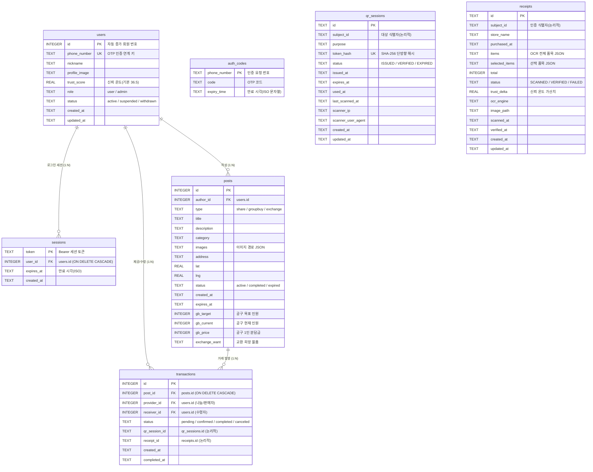

# NeighborFood ERD 문서

동네 식재료 나눔·공동구매·교환 플랫폼의 데이터베이스 구조 문서입니다.
3개로 분리돼 있던 SQLite(`auth.db` / `qr_auth.db` / `receipt_auth.db`)를 **단일 SQLite 파일(`neighborfood.db`)** 로 통합하고, 회원 기능 도입에 맞춰 `users`·`sessions`·`transactions`를 추가한 현행 구조를 정리합니다.

> 최종 갱신: 2026-06-07 · 단일 SQLite 통합 및 FK 적용 반영

- **DBMS**: SQLite 3 (단일 파일 `data/neighborfood.db`)
- **테이블 수**: 7개 (`users`, `sessions`, `auth_codes`, `posts`, `transactions`, `qr_sessions`, `receipts`)
- **접속 계층**: `app/db/*.py` — 모든 연결이 `make_conn(DB_PATH, foreign_keys=True)`로 동일 파일을 공유
- **스키마 원본**: `sql/neighborfood_schema.sql`

---

## 1. ERD 다이어그램

> `users.author_id`·`transactions`의 FK는 **물리 FK로 적용 완료**입니다(단일 파일 통합으로 활성화).
> `qr_sessions.subject_id` / `receipts.subject_id`는 기존 흐름 보존을 위해 **논리적 참조(TEXT)** 로 유지하며, 거래 정합성은 `transactions.qr_session_id` / `receipt_id`를 통해 연결합니다.

---

## 2. 테이블 관계 요약

| 부모 | 자식 | 연결 컬럼 | 관계 | FK | 의미 |
|------|------|-----------|------|----|------|
| `users` | `sessions` | `user_id` | 1 : N | ✅ (CASCADE) | 한 회원의 여러 로그인 세션 |
| `users` | `posts` | `author_id` | 1 : N | ✅ | 한 회원이 여러 게시글 작성 |
| `users` | `transactions` | `provider_id` / `receiver_id` | 1 : N | ✅ | 회원이 제공/수령한 거래 |
| `posts` | `transactions` | `post_id` | 1 : N | ✅ (CASCADE) | 한 게시글에서 발생한 거래 |
| `posts` | `qr_sessions` | `subject_id` | 1 : N | 논리적 | 게시글 대상 QR 세션 |
| `users` | `receipts` | `subject_id` | 1 : N | 논리적 | 회원의 영수증 인증 |
| `transactions` | `qr_sessions` | `qr_session_id` | 1 : 1 | 논리적 | 거래에 연계된 QR |
| `transactions` | `receipts` | `receipt_id` | 1 : 1 | 논리적 | 거래에 연계된 영수증 |

---

## 3. `users` — 회원

휴대폰(OTP) 인증을 통과한 번호로 자동 가입되는 핵심 기준 테이블.

| 컬럼 | 타입 | 키 | 설명 |
|------|------|----|------|
| `id` | `INTEGER` | PK (AUTOINCREMENT) | 자동 증가 회원 번호. 타 테이블 참조 기준 |
| `phone_number` | `TEXT` | UK, NOT NULL | 휴대폰 번호. 중복 불가 |
| `nickname` | `TEXT` | | 표시 닉네임. 가입 직후 NULL 허용 |
| `profile_image` | `TEXT` | | 프로필 이미지 경로/URL |
| `trust_score` | `REAL` | | 신뢰 온도. 기본 36.5, 영수증·매너로 가감 |
| `role` | `TEXT` | | `user`/`admin` (CHECK). 기본 `user` |
| `status` | `TEXT` | | `active`/`suspended`/`withdrawn` (CHECK). 기본 `active` (탈퇴=소프트삭제) |
| `created_at` / `updated_at` | `TEXT` | | ISO-8601 문자열 |

---

## 4. `sessions` — 로그인 세션 (신규)

`/verify-auth` 성공 시 발급되는 Bearer 토큰 저장소. `Authorization: Bearer <token>` 으로 회원을 식별한다.

| 컬럼 | 타입 | 키 | 설명 |
|------|------|----|------|
| `token` | `TEXT` | PK | `secrets.token_urlsafe(32)` 원본 토큰 |
| `user_id` | `INTEGER` | FK → `users.id` | `ON DELETE CASCADE` |
| `expires_at` | `TEXT` | | 만료 시각(ISO). 경과 시 401 |
| `created_at` | `TEXT` | | 발급 시각 |

---

## 5. `auth_codes` — OTP 인증코드

SMS로 발송되는 일회성 인증번호의 임시 저장소. 인증 성공 시 즉시 삭제.

| 컬럼 | 타입 | 키 | 설명 |
|------|------|----|------|
| `phone_number` | `TEXT` | PK | 재요청 시 `INSERT OR REPLACE` |
| `code` | `TEXT` | | 6자리 인증번호 |
| `expiry_time` | `TEXT` | | 만료 시각(ISO 문자열) |

---

## 6. `posts` — 게시글

나눔·공동구매·교환 세 종류를 한 테이블에 통합. `type`에 따라 `gb_*`/`exchange_want`가 활성화된다.

| 컬럼 | 타입 | 키 | 설명 |
|------|------|----|------|
| `id` | `INTEGER` | PK (AUTOINCREMENT) | 게시글 번호 |
| `author_id` | `INTEGER` | FK → `users.id`, NOT NULL | 작성자 |
| `type` | `TEXT` | | `share`/`groupbuy`/`exchange` |
| `title` | `TEXT` | NOT NULL | 제목 |
| `description` | `TEXT` | | 본문 |
| `category` | `TEXT` | | 식재료 카테고리 |
| `images` | `TEXT` | | 이미지 경로 JSON 배열(텍스트), 기본 `'[]'` |
| `address` | `TEXT` | | 거래 장소명 |
| `lat` / `lng` | `REAL` | | 거래 장소 좌표 |
| `status` | `TEXT` | | `active`/`completed`/`expired`, 기본 `active` |
| `created_at` | `TEXT` | NOT NULL | 작성 일시(ISO) |
| `expires_at` | `TEXT` | | 마감 일시. NULL이면 무기한 |
| `gb_target` / `gb_current` / `gb_price` | `INTEGER` | | [공구] 목표·현재 인원·1인 분담금 |
| `exchange_want` | `TEXT` | | [교환] 희망 물품 설명 |

**인덱스**: `(type, created_at)`, `(author_id)`

---

## 7. `transactions` — 거래 (신규, 앵커 테이블)

정산·매너평가·신고·거래내역이 공통으로 참조할 '하나의 거래' 단위. 향후 기능 테이블이 이 `id`를 FK로 참조한다.

| 컬럼 | 타입 | 키 | 설명 |
|------|------|----|------|
| `id` | `INTEGER` | PK (AUTOINCREMENT) | 거래 번호 |
| `post_id` | `INTEGER` | FK → `posts.id` | `ON DELETE CASCADE` |
| `provider_id` | `INTEGER` | FK → `users.id`, NOT NULL | 나눔/판매자 |
| `receiver_id` | `INTEGER` | FK → `users.id` | 수령자 |
| `status` | `TEXT` | | `pending`/`confirmed`/`completed`/`canceled` (CHECK) |
| `qr_session_id` | `TEXT` | | 연계 `qr_sessions.id` (선택) |
| `receipt_id` | `TEXT` | | 연계 `receipts.id` (선택) |
| `created_at` / `completed_at` | `TEXT` | | 생성·완료 일시 |

**인덱스**: `(provider_id, created_at)`, `(receiver_id, created_at)`, `(post_id)`

---

## 8. `qr_sessions` — QR 거래 인증

대면 거래 수령 확인용 일회용 토큰. 원본은 저장하지 않고 SHA-256 해시만 보관.

| 컬럼 | 타입 | 키 | 설명 |
|------|------|----|------|
| `id` | `TEXT` | PK | `qrs_` + 랜덤 hex |
| `subject_id` | `TEXT` | (논리적) | 대상 식별자 |
| `purpose` | `TEXT` | | 발행 목적(예: `pickup_confirm`) |
| `token_hash` | `TEXT` | UK | 원본 토큰의 SHA-256 해시 |
| `status` | `TEXT` | | `ISSUED`/`VERIFIED`/`EXPIRED` (CHECK) |
| `issued_at` / `expires_at` | `TEXT` | | 발급·만료 시각 |
| `used_at` / `last_scanned_at` | `TEXT` | | 검증·최근 스캔 시각 |
| `scanner_ip` / `scanner_user_agent` | `TEXT` | | 스캔 기기 정보 |
| `created_at` / `updated_at` | `TEXT` | | 생성·수정 일시 |

**인덱스**: `(subject_id, issued_at)`, `(status, expires_at)`, `(token_hash)`

---

## 9. `receipts` — 영수증 OCR 인증

영수증 이미지를 OCR로 분석해 품목을 추출하고, 선택 품목으로 인증해 신뢰 온도를 올린다. `image_path`는 PII 마스킹 후 경로만 저장.

| 컬럼 | 타입 | 키 | 설명 |
|------|------|----|------|
| `id` | `TEXT` | PK | `rcpt_` + 랜덤 hex |
| `subject_id` | `TEXT` | (논리적) | 인증 수행 식별자 |
| `store_name` / `purchased_at` | `TEXT` | | OCR 점포명·결제 일시 |
| `items` / `selected_items` | `TEXT` | | OCR 전체/선택 품목 JSON, 기본 `'[]'` |
| `total` | `INTEGER` | | 결제 총액(원) |
| `status` | `TEXT` | | `SCANNED`/`VERIFIED`/`FAILED` (CHECK) |
| `trust_delta` | `REAL` | | 가산 점수(기본 0.3) |
| `ocr_engine` | `TEXT` | | `tesseract`/`demo` 등 |
| `image_path` | `TEXT` | | PII 마스킹 후 저장 경로 |
| `scanned_at` / `verified_at` | `TEXT` | | 스캔·인증 완료 시각 |
| `created_at` / `updated_at` | `TEXT` | | 생성·수정 일시 |

**인덱스**: `(subject_id, scanned_at)`, `(status, scanned_at)`

---

## 10. 설계 결정 메모

### 10.1 타임스탬프를 `TEXT`(ISO-8601)로 두는 이유
애플리케이션이 모든 시각을 ISO-8601 문자열로 저장하고 `from_iso()`/`fromisoformat()`으로 비교합니다. UTC ISO 문자열은 **사전식 정렬 = 시간순 정렬**이라 `ORDER BY`·범위 비교가 그대로 동작합니다. SQLite는 별도 DATETIME 타입이 없어 TEXT 보관이 자연스럽습니다.

### 10.2 JSON을 `TEXT`로 저장
`images`/`items`/`selected_items`는 JSON을 텍스트로 저장하며, 코드의 `json.loads(value or "[]")` 패턴이 NULL/빈 값을 안전하게 처리합니다.

### 10.3 외래키(FK) 적용 범위
단일 파일 통합으로 FK가 가능해져 `posts.author_id`와 `transactions`의 회원/게시글 참조에 **물리 FK를 적용**했습니다. 반면 `qr_sessions`/`receipts`의 `subject_id`는 기존에 자유 문자열로 운용되던 흐름을 깨지 않기 위해 논리적 참조로 남겨 두고, 거래 단위 정합성은 `transactions`를 통해 확보합니다. 모든 연결은 `foreign_keys=True`로 생성됩니다.

### 10.4 회원 가입 = OTP 인증 일원화
별도 회원가입 폼 없이 `/verify-auth` 성공 시 `users`에 자동 upsert하고 세션을 발급합니다. 탈퇴는 행 삭제 대신 `status='withdrawn'` 소프트삭제로 거래 이력 무결성을 보존합니다.

---

## 11. 관련 파일

| 파일 | 역할 |
|------|------|
| `sql/neighborfood_schema.sql` | 전체 테이블 생성 스크립트 (단일 진실 소스) |
| `data/neighborfood.db` | 단일 SQLite 데이터 파일 (startup 시 자동 생성) |
| `app/db/base.py` | 연결 팩토리, `init_all_databases()` |
| `app/db/auth_db.py` | `users`·`sessions`·`auth_codes`·`posts` |
| `app/db/transaction_db.py` | `transactions` |
| `app/db/qr_db.py` / `receipt_db.py` | `qr_sessions` / `receipts` |
| `app/core/deps.py` | 세션 토큰 인증/인가 |
| `main.py` | FastAPI 서버 본체 |
