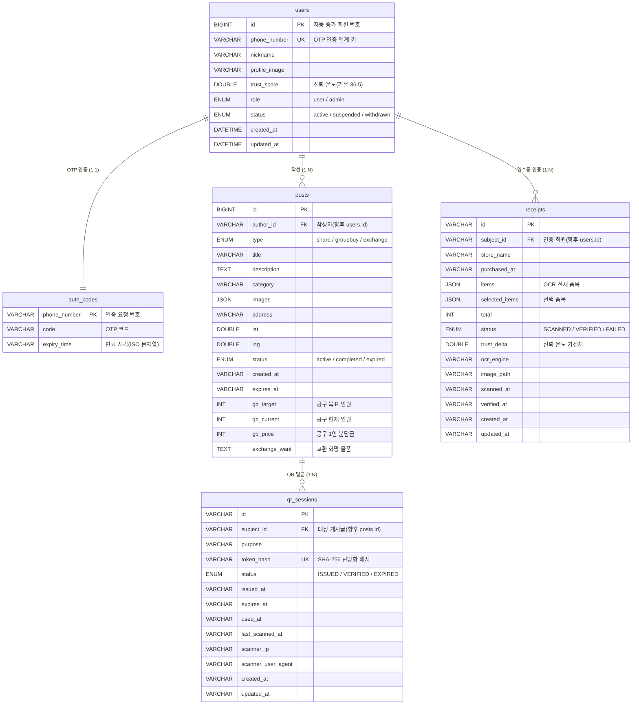

# NeighborFood ERD 문서

동네 식재료 나눔·공동구매·교환 플랫폼의 데이터베이스 구조 문서입니다.
기존 SQLite 3개(`auth.db` / `qr_auth.db` / `receipt_auth.db`)를 단일 MariaDB(`neighborfood`)로 통합한 결과를 정리합니다.

- **DBMS**: MariaDB 10.x (`utf8mb4` / `utf8mb4_unicode_ci`)
- **테이블 수**: 5개 (`users`, `auth_codes`, `posts`, `qr_sessions`, `receipts`)
- **접속 계층**: `db.py` 어댑터(PyMySQL) — 애플리케이션은 기존 SQLite API 형태를 그대로 사용

---

## 1. ERD 다이어그램



> 위 관계 중 FK로 표시된 `author_id` / `subject_id`는 **현재 논리적 관계**입니다.
> 값이 아직 문자열 식별자(`VARCHAR`)라 물리 FK 제약은 회원 기능 도입 시 적용합니다(아래 8장 참고).

---

## 2. 테이블 관계 요약

| 부모 | 자식 | 연결 컬럼 | 관계 | 의미 |
|------|------|-----------|------|------|
| `users` | `posts` | `author_id` | 1 : N | 한 회원이 여러 게시글 작성 |
| `users` | `receipts` | `subject_id` | 1 : N | 한 회원이 여러 영수증 인증 |
| `posts` | `qr_sessions` | `subject_id` | 1 : N | 한 게시글에 여러 QR 세션 발급 |
| `users` | `auth_codes` | `phone_number` | 1 : 1 | 회원 인증용 OTP 발급 |

---

## 3. `users` — 회원

서비스의 모든 회원 정보를 저장하는 핵심 테이블. 회원 기능 구현을 위해 신규 추가되었으며, 게시글·영수증 인증과 연결되는 기준 테이블입니다.

| 컬럼 | 타입 | 키 | 설명 |
|------|------|----|------|
| `id` | `BIGINT AUTO_INCREMENT` | PK | 자동 증가 회원 고유 번호. 타 테이블이 참조하는 기준값 |
| `phone_number` | `VARCHAR(20)` | UK | 휴대폰 번호. `auth_codes` 인증을 통과한 번호만 등록, 중복 불가 |
| `nickname` | `VARCHAR(30)` | | 표시 닉네임. 가입 직후 NULL 허용 |
| `profile_image` | `VARCHAR(500)` | | 프로필 이미지 URL. 없으면 NULL |
| `trust_score` | `DOUBLE` | | 신뢰 온도(°). 기본 36.5, 영수증·매너 평가로 가감 |
| `role` | `ENUM('user','admin')` | | 권한 구분. 기본 `user` |
| `status` | `ENUM('active','suspended','withdrawn')` | | 계정 상태. 기본 `active` |
| `created_at` | `DATETIME` | | 계정 생성 일시(자동) |
| `updated_at` | `DATETIME` | | 마지막 수정 일시(자동 갱신) |

---

## 4. `auth_codes` — OTP 인증코드

회원가입·로그인 시 SMS로 발송되는 일회성 인증번호를 임시 저장. 인증 성공 시 만료·폐기되는 단명 데이터입니다.

| 컬럼 | 타입 | 키 | 설명 |
|------|------|----|------|
| `phone_number` | `VARCHAR(20)` | PK | 인증 요청 번호. 동일 번호 재요청 시 기존 코드 덮어씀(`REPLACE`) |
| `code` | `VARCHAR(10)` | | 4~6자리 인증번호 |
| `expiry_time` | `VARCHAR(40)` | | 만료 시각(ISO-8601 문자열). 경과 시 인증 실패 처리 |

---

## 5. `posts` — 게시글

나눔·공동구매·교환 세 종류를 한 테이블에 통합. `type` 값에 따라 활성화되는 전용 필드(`gb_*`, `exchange_want`)가 달라집니다.

| 컬럼 | 타입 | 키 | 설명 |
|------|------|----|------|
| `id` | `BIGINT AUTO_INCREMENT` | PK | 게시글 고유 번호. `qr_sessions.subject_id`가 참조 |
| `author_id` | `VARCHAR(64)` | FK | 작성자 식별자(향후 `users.id`) |
| `type` | `ENUM('share','groupbuy','exchange')` | | 게시글 종류 |
| `title` | `VARCHAR(200)` | | 제목 |
| `description` | `TEXT` | | 본문 |
| `category` | `VARCHAR(50)` | | 식재료 카테고리(채소/과일/냉동 등) |
| `images` | `JSON` | | 이미지 URL 배열 |
| `address` | `VARCHAR(300)` | | 거래 장소명 |
| `lat` / `lng` | `DOUBLE` | | 거래 장소 위도·경도 |
| `status` | `ENUM('active','completed','expired')` | | 게시글 상태 |
| `created_at` | `VARCHAR(40)` | | 작성 일시(ISO 문자열) |
| `expires_at` | `VARCHAR(40)` | | 마감 일시. NULL이면 무기한 |
| `gb_target` | `INT` | | [공구] 목표 인원/수량 |
| `gb_current` | `INT` | | [공구] 현재 참여 인원 |
| `gb_price` | `INT` | | [공구] 1인 분담금(원) |
| `exchange_want` | `TEXT` | | [교환] 희망 물품 설명 |

**인덱스**: `(type, created_at)`, `(author_id)`

---

## 6. `qr_sessions` — QR 거래 인증

대면 거래 시 수령을 확인하는 일회용 QR 토큰 세션. 발급 → 스캔 → 만료(또는 검증) 상태를 추적합니다.

| 컬럼 | 타입 | 키 | 설명 |
|------|------|----|------|
| `id` | `VARCHAR(40)` | PK | QR 세션 고유 ID(UUID/랜덤 hex) |
| `subject_id` | `VARCHAR(64)` | FK | 대상 게시글 식별자(향후 `posts.id`) |
| `purpose` | `VARCHAR(50)` | | 발행 목적(`pickup_confirm` 등) |
| `token_hash` | `VARCHAR(64)` | UK | 원본 토큰의 SHA-256 해시(단방향) |
| `status` | `ENUM('ISSUED','VERIFIED','EXPIRED')` | | QR 상태 |
| `issued_at` | `VARCHAR(40)` | | 발급 시각 |
| `expires_at` | `VARCHAR(40)` | | 만료 시각. 경과 시 자동 `EXPIRED` |
| `used_at` | `VARCHAR(40)` | | 검증 완료 시각 |
| `last_scanned_at` | `VARCHAR(40)` | | 마지막 스캔 시각(실패 포함) |
| `scanner_ip` | `VARCHAR(45)` | | 스캔 기기 IP(IPv6 포함) |
| `scanner_user_agent` | `VARCHAR(500)` | | 스캔 기기 브라우저·OS 정보 |
| `created_at` / `updated_at` | `VARCHAR(40)` | | 생성·수정 일시 |

**인덱스**: `(subject_id, issued_at)`, `(status, expires_at)`

---

## 7. `receipts` — 영수증 OCR 인증

영수증 이미지를 업로드해 OCR로 품목을 추출하고, 사용자가 선택한 품목으로 인증해 신뢰 온도를 올리는 흐름을 저장합니다.

| 컬럼 | 타입 | 키 | 설명 |
|------|------|----|------|
| `id` | `VARCHAR(40)` | PK | 인증 세션 ID(`rcpt_` + 랜덤 hex) |
| `subject_id` | `VARCHAR(64)` | FK | 인증 수행 회원(향후 `users.id`) |
| `store_name` | `VARCHAR(200)` | | OCR 인식 점포명 |
| `purchased_at` | `VARCHAR(40)` | | 결제 일시(OCR 파싱) |
| `items` | `JSON` | | OCR 추출 전체 품목 배열 |
| `selected_items` | `JSON` | | 사용자 선택 품목 배열 |
| `total` | `INT` | | 결제 총액(원) |
| `status` | `ENUM('SCANNED','VERIFIED','FAILED')` | | 인증 진행 상태 |
| `trust_delta` | `DOUBLE` | | 인증 성공 시 가산 점수(기본 0.3°) |
| `ocr_engine` | `VARCHAR(30)` | | OCR 엔진(`tesseract`/`demo` 등) |
| `image_path` | `VARCHAR(500)` | | PII 마스킹 후 저장 경로 |
| `scanned_at` | `VARCHAR(40)` | | OCR 처리 완료 시각 |
| `verified_at` | `VARCHAR(40)` | | 최종 인증 완료 시각 |
| `created_at` / `updated_at` | `VARCHAR(40)` | | 생성·수정 일시 |

**인덱스**: `(subject_id, scanned_at)`, `(status, scanned_at)`

---

## 8. 설계 결정 메모

### 8.1 타임스탬프를 `VARCHAR(40)`으로 둔 이유

애플리케이션 코드가 모든 시각을 ISO-8601 문자열로 저장하고 `datetime.fromisoformat()`으로 비교합니다. `DATETIME`으로 바꾸면 이 비교 로직 전체를 수정해야 해 위험이 큽니다. UTC ISO 문자열은 **사전식 정렬 = 시간순 정렬**이라 `ORDER BY`와 범위 비교가 그대로 동작하므로, 문자열 계약을 보존하는 것이 가장 안전합니다. (`users` 테이블은 신규라 네이티브 `DATETIME`을 적용)

### 8.2 JSON 타입 사용

`images` / `items` / `selected_items`는 `JSON` 타입(NULL 허용)입니다. 코드의 `json.loads(value or "[]")` 패턴이 NULL을 빈 배열로 안전하게 처리합니다.

### 8.3 외래키(FK)를 아직 걸지 않은 이유

회원 기능 미구현 단계에서 `author_id` / `subject_id`는 임의 문자열입니다. 지금 `users` FK를 강제하면 현재 동작하는 게시판·QR·영수증 흐름이 즉시 깨집니다. 그래서 `users` 테이블과 인덱스는 준비해 두되, 물리 FK는 회원 마이그레이션 완료 후 적용합니다.

```sql
-- (향후) 회원 기능 도입 시 활성화
ALTER TABLE posts       MODIFY author_id BIGINT NOT NULL;
ALTER TABLE posts       ADD CONSTRAINT fk_posts_author  FOREIGN KEY (author_id)  REFERENCES users(id);
ALTER TABLE qr_sessions MODIFY subject_id BIGINT NOT NULL;
ALTER TABLE qr_sessions ADD CONSTRAINT fk_qr_post       FOREIGN KEY (subject_id) REFERENCES posts(id);
ALTER TABLE receipts    MODIFY subject_id BIGINT;
ALTER TABLE receipts    ADD CONSTRAINT fk_receipts_user FOREIGN KEY (subject_id) REFERENCES users(id);
```

---

## 9. 관련 파일

| 파일 | 역할 |
|------|------|
| `neighborfood_schema.sql` | 전체 테이블 생성 스크립트 |
| `db.py` | MariaDB 접속 어댑터(PyMySQL) |
| `main.py` | FastAPI 서버 본체 |
| `.env` | DB 접속 정보(비공개) |
| `neighborfood_ERD.png` / `.pdf` / `.svg` | ERD 다이어그램 이미지 |
